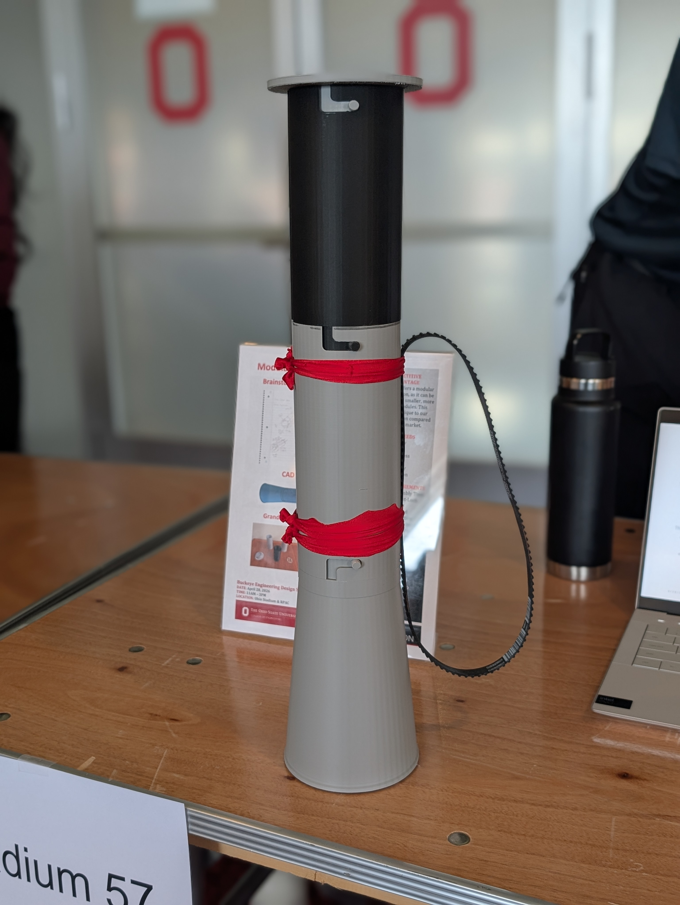
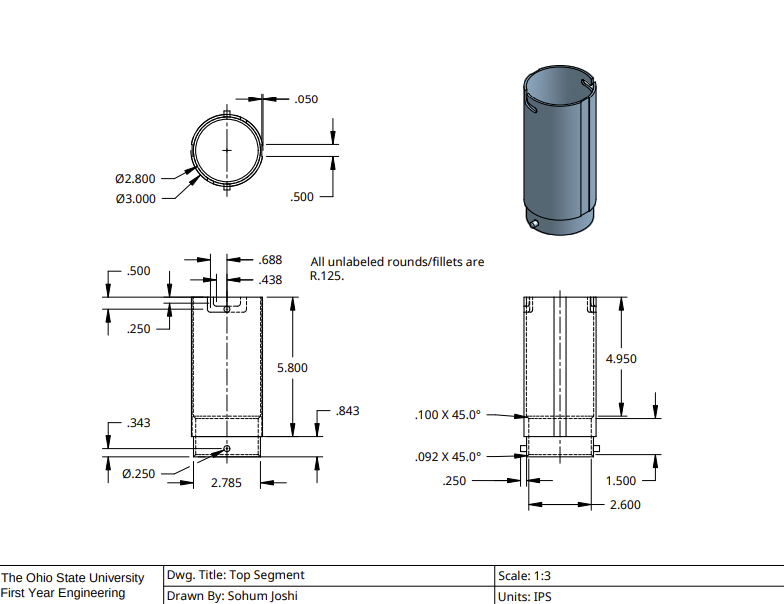
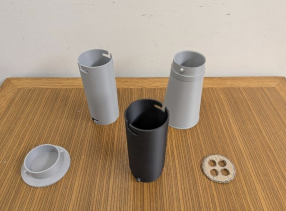
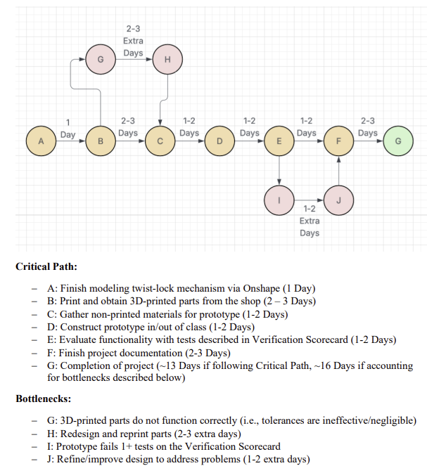
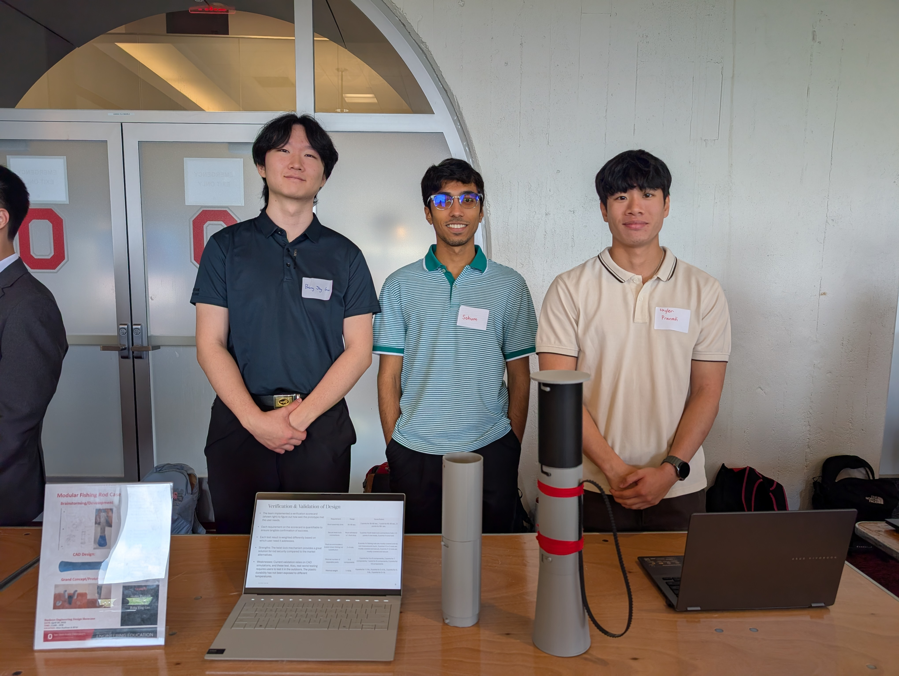

# Modular Fishing Rod Carrier

A portable, modular transportation case designed for multi-piece fishing rod storage and transport. Designed and fabricated as part of a 4-person team engineering project in Fundamentals of Engineering II (ENGR 1182) at The Ohio State University. This project addressed the issues and difficulties associated with transporting fishing equipment. Through user interviews and research, the team identified that standard fishing storage solutions fall short in accommodating fishing rods, resulting in inefficient transport and equipment damage.

The team designed, modeled, and fabricated a scaled-down modular carrier featuring an interlocking twist-lock mechanism to connect multiple segments into one protective assembly.

  

---

## Project Overview

* **Context:** ENGR 1182 (Fundamentals of Engineering) – Team D, The Ohio State University
* **CAD Modeling:** Modeled 3D parts and assembly in Onshape
* **Manufacturing:** Physical prototype 3D printed in PLA
* **Functionality:** Integrated twist-lock joints utilizing friction fit to maintain connection without slippage
* **Core User Needs:** Modularity, portability, compactness, and rod protection

---

## Individual Responsibilities (Skyler Pranadi)

* **Lead CAD Design (Onshape):** Designed and modeled all 3D parts and full assembly, including the conical base, middle/top segments, internal separator disk, and lid.
* **Mechanism & Tolerancing:** Designed the 2-pin twist-lock joint with a 0.015 in clearance to ensure a reliable friction fit on FDM 3D printers.
* **Project Management:** Built and managed the PERT critical path schedule and Gantt chart to track team milestones and prevent setbacks, including printing/shop delays.
* **Fabrication & Testing:** Prepared CAD models for 3D printing, assembled physical hardware, and conducted drop-testing verification.

## Detailed Design & Architecture

The full concept was developed as a modular design that scales to fit rod lengths, allowing users to twist and lock each section to reduce setup time and fit equipment into smaller vehicle spaces. For physical verification, the team prototyped a 1:3 scaled-down version.

  

### Component Breakdown
1. **Bottom Segment (Base):** Features a widened conical base (expanding to **Ø4.100 in**) designed to accommodate rod handles and reels while keeping the case stable. Silicone rubber strips are fitted to the base to provide ground grip.
2. **Middle & Top Segments:** Modular cylindrical segments (**Ø3.000 in** OD, **Ø2.800 in** ID) that lock together to envelop the rod bodies.
3. **Internal Disk:** An interior plate with four **Ø0.750 in** holes designed to secure up to 4 individual rods and prevent them from colliding with each other or the inner shell.
4. **Lid / Top Cap:** Encloses the top segment using the same twist-lock mechanism to seal out debris while allowing moisture to evaporate to help prevent rust.
5. **Strap & Bands:** External cloth bands holding a shoulder strap for diagonal carrying.

---

## Twist-Lock Mechanism & Tolerancing

The twist-lock connection was designed to balance ease of assembly with structural integrity. As shown below, the ends of the modules have either a protruding pin or a pin path. The pin can "lock" onto the path via friction fit, and allows the user to stack modules on top of each other.

  

* **Pins:** Dual cylindrical protrusions with a diameter of **Ø0.250 in**.
* **Slots:** L-shaped paths featuring a **0.438 in** entry slot and **0.688 in** horizontal track to lock the pin.
* **Mating Clearance:** Male sleeve section (**Ø2.785 in**) inserts into the female cylinder bore (**Ø2.800 in**), yielding a **0.015 in** clearance designed to maintain a secure friction-fit connection across 3D-printed tolerances.

---

## Prototype Testing & Verification

The team evaluated the physical prototype against a quantitative Verification Scorecard across multiple test runs. These tests were verified by OSU Engineering faculty.

  

| Requirement | Target Criteria | Result / Performance | Scorecard Status |
| :--- | :--- | :--- | :--- |
| **Assembly Time** | Assemble all 3 modules within 30–90 seconds | Average setup time achieved between 60–80 seconds | **Passed (Full Credit)** |
| **Twist-Lock Strength** | Must withstand a 1-foot drop test | Segments stayed connected with no damage from 11.5" drop | **Passed (Full Credit)** |
| **Storage Capacity** | Secure 2–4 scaled fishing rod substitutes | Accommodated 4 rods held secure by the internal disk | **Passed (Full Credit)** |
| **Separable Parts** | Maintain 5–8 total components | 5 primary printed components (Base, Middle, Top, Lid, Disk) | **Passed (Full Credit)** |
| **Minimal Weight** | Keep total weight between 1–10 lbs | Fabricated prototype weighed ~1.1 lbs (484.4 g PLA) | **Passed (Full Credit)** |

---

## Project Management & Schedule

To organize tasks and meet project deadlines, the team outlined a critical path and bottleneck contingency plan using a PERT schedule and Gantt chart:

  

* **Critical Path:** Finish Onshape CAD Modeling (A) $\rightarrow$ 3D Print Parts (B) $\rightarrow$ Gather Non-Printed Materials (C) $\rightarrow$ Construct Prototype (D) $\rightarrow$ Evaluate Functionality via Scorecard (E) $\rightarrow$ Final Documentation (F).
* **Bottlenecks Planned For:** Tolerances/reprints at the shop (Nodes G–H) and testing refinement loops (Nodes I–J).

---

## Presentation

This project was hand-picked by OSU Engineering faculty for the Engineering Design Showcase at **The Ohio State University** (Spring 2026). The team had the privilege of presenting and pitching the design to industry professionals on April 28, 2026.

  

Special thanks to Sohum Joshi, Franky Lee, and Bang Ying Gao for their respective roles and contributions to this project! 

---

## Repository Files

* `/cad/stl/`: 3D printable STL files for all prototype components (Base, Middle, Top, Lid, Disk).
* `/docs/`: Complete 2D Working Drawing Packet (`FD3 – Prototype Working Drawings Packet.pdf`).
* `/assets/`: Assembly photos, dimensioned drawings, and project management schedules.
